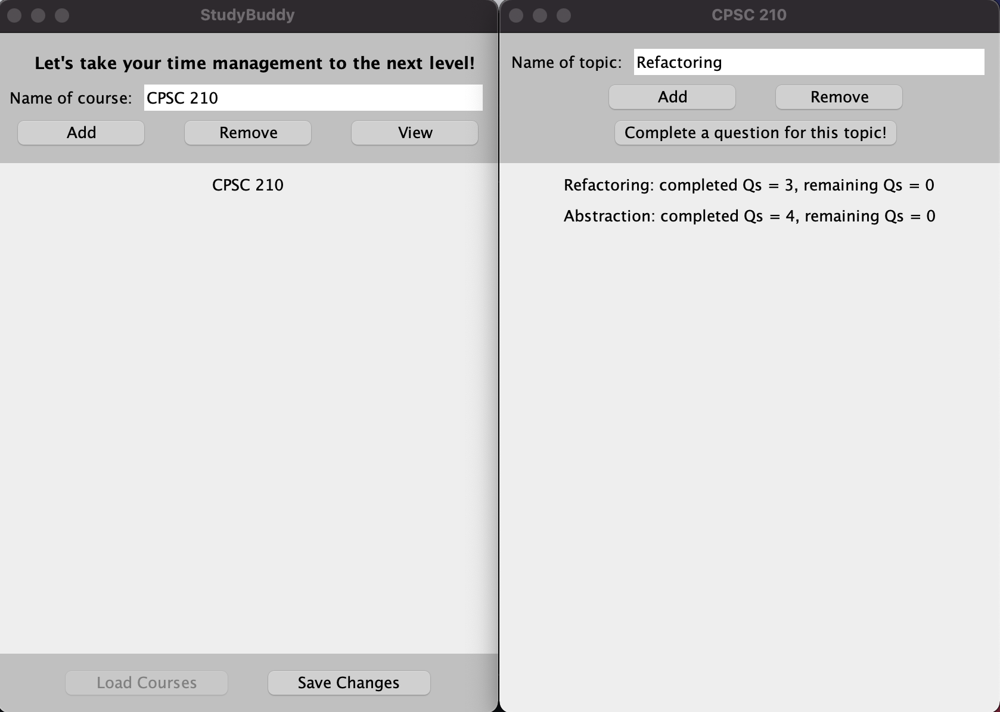

# StudyBuddy

## Purpose

With the immense workload of university students, effective studying and time management become essential 
to success. The **StudyBuddy** application addresses this problem by allowing university students 
to track club dates, course dates, and the practice questions they complete for their courses. 

For many university courses, independent practice is essential to performing well in exams. 
To ensure academic success, the main feature of **StudyBuddy** allows its users to create topics for 
each of their courses and assign a *minimum* of three relevant practice questions to each topic. 
The aim of this feature is to encourage students to identify exam-worthy subjects and then 
do a minimum of three practice problems per each topic so that they can master what they are taught in lectures.
With this set-up, **StudyBuddy** will help students manage their time more effectively, make their 
learning more efficient, and hopefully reduce their exam-related stress.
 
## Key Features

StudyBuddy includes both a console-based component and a GUI component. 

The console-based component supports the following features:
- Add multiple Dates to user's Clubs and Courses
- Classify user's Dates as an EXAM, PROJECT, MEETING, or OTHER
- Add multiple reminders to user's Clubs
- Add multiple Topics to user's Courses
- Track number of practice questions user has completed for a Topic
- Track number of practice questions user needs to complete for a Topic
- Save user's changes to file and reload user's changes from file
- Log user's activty to the console upon application's termination

The GUI component supports the following features:
- Add multiple Courses and multiple Topics to each Course
- Remove Topics from user's Courses
- Complete questions for a Topic in user's Course and display an image upon success
- Display all of user's Courses in one window
- See a Course choen by user and its Topics in a separate window
- Save user's changes to file and reload changes from file

## How to Use
To run the console-based component, you will need to run the **Main.java** file in **src/main/ui**.

To run the GUI component, you will need to run the **StudyBuddyGUI.java** file in **src/main/ui**.

## How to Contribute
Here are just a few ways that interested individuals can contribute to this project:
- Improve cohesion of StudyBuddyGUI.java by creating a separate class for the methods related to the functionalities of the buttons 
- Extend the features of the GUI component to support adding Dates to Courses
- Extend the features of the GUI component to support adding Clubs and its related entities (e.g. Dates, and reminders)
